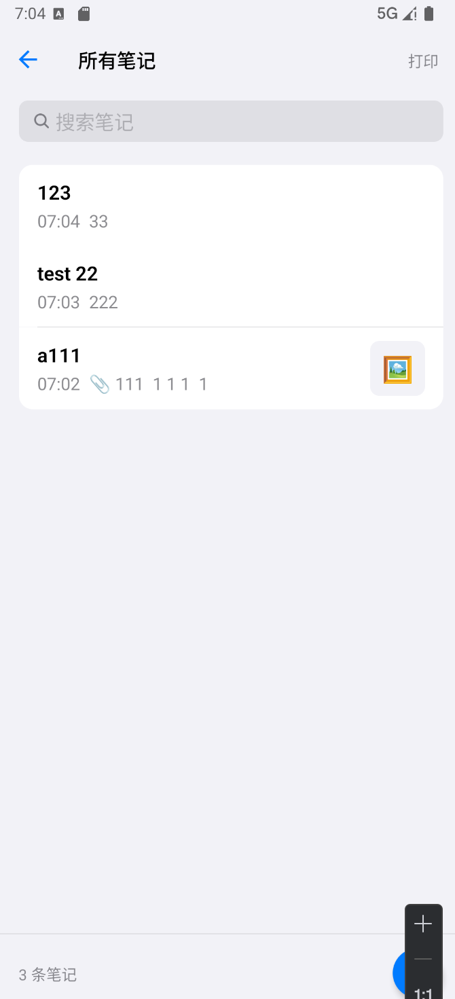

# AI 复盘助手 APP

记录 + AI 复盘一体化工具，Apple 备忘录风格，支持文件夹管理、富文本记录和多格式附件。

## 技术栈

- **框架**: React Native + Expo (SDK 52)
- **语言**: TypeScript
- **状态管理**: Zustand + AsyncStorage 持久化
- **导航**: React Navigation (Native Stack)
- **附件**: expo-image-picker / expo-document-picker / expo-av

## 环境要求

- Node.js >= 18（推荐使用 [nvm](https://github.com/nvm-sh/nvm) 或 [nvm-windows](https://github.com/coreybutler/nvm-windows) 管理）
- npm >= 9

## 快速开始

```bash
# 1. 安装依赖
npm install

# 2. 启动开发服务器
npx expo start
```

启动后可选择运行方式：

| 按键 | 操作 |
|------|------|
| `w`  | 在浏览器中打开 Web 版 |
| `a`  | 在 Android 模拟器/设备运行 |
| `i`  | 在 iOS 模拟器运行（仅 macOS） |
| `r`  | 重新加载 |
| `j`  | 打开调试器 |

## 手机预览

1. 手机安装 [Expo Go](https://expo.dev/go)（iOS / Android）
2. 扫描终端中的 QR 码即可实时预览

## 常用命令

```bash
# 启动开发服务器
npx expo start

# 启动并自动打开 Web
npx expo start --web

# 清除缓存启动
npx expo start --clear

# 安装 Expo 兼容版本的包
npx expo install <package-name>

# 生成原生工程（需要时）
npx expo prebuild

# 构建 iOS（仅 macOS + Xcode）
npx expo run:ios

# 构建 Android（需 Android Studio）
npx expo run:android
```

## 项目结构

```
├── app/                  # Expo Router 入口
│   ├── _layout.tsx
│   └── index.tsx
├── src/
│   ├── navigation/       # 导航配置
│   ├── screens/          # 页面组件
│   │   ├── FoldersScreen.tsx      # 文件夹列表
│   │   ├── NotesListScreen.tsx    # 笔记列表
│   │   └── NoteEditorScreen.tsx   # 笔记编辑
│   ├── store/            # Zustand 状态管理
│   ├── theme/            # 主题配置（Apple 风格）
│   └── types/            # TypeScript 类型定义
├── App.tsx               # 根组件
├── app.json              # Expo 配置
└── package.json
```

## 日记存储格式

### 存储位置

- **存储方式**：Zustand + `persist` 中间件
- **底层**：`AsyncStorage`（React Native 异步键值存储）
- **持久化 key**：`notebook-ai-storage`

### 持久化数据结构

```json
{
  "folders": [],
  "notes": [],
  "sortType": "updatedAt",
  "sortOrder": "desc"
}
```

### 单条日记（Note）结构

| 字段 | 类型 | 说明 |
|------|------|------|
| `id` | string | 唯一标识 |
| `folderId` | string | 所属文件夹 ID |
| `title` | string | 标题 |
| `content` | string | 正文纯文本，多段用 `\n` 换行 |
| `attachments` | Attachment[] | 附件列表（按出现顺序） |
| `blocks` | StoredBlock[]? | 块结构，保留文字与附件的交错顺序；无此字段时用 content+attachments 兼容旧数据 |
| `isPinned` | boolean | 是否置顶 |
| `createdAt` | string | 创建时间（ISO 8601） |
| `updatedAt` | string | 更新时间（ISO 8601） |

### 块结构（StoredBlock，用于 blocks 字段）

```typescript
type StoredBlock =
  | { kind: 'text'; text: string }
  | { kind: 'media'; attachment: Attachment };
```

### 附件（Attachment）结构

| 字段 | 类型 | 说明 |
|------|------|------|
| `id` | string | 唯一标识 |
| `type` | string | `image` \| `video` \| `audio` \| `file` |
| `uri` | string | 本地路径（file:// 或 expo asset uri） |
| `fileName` | string | 文件名 |
| `fileSize` | number? | 文件大小（字节） |
| `mimeType` | string? | MIME 类型 |
| `duration` | number? | 音视频时长（秒） |
| `thumbnailUri` | string? | 缩略图路径 |
| `createdAt` | string | 创建时间（ISO 8601） |

### 正文 content 格式

- 纯文本，多段之间用 `\n` 分隔
- 由所有文字块按顺序拼接而成，连续 3 个及以上换行会压缩为 2 个
- 示例：`"第一段文字\n第二段文字\n第三段文字"`

### 正文与附件的关系

- **编辑时**：正文与附件交错排列（文字块 → 附件块 → 文字块 → …）
- **存储时**：`content`、`attachments` 与 `blocks` 一并保存；`blocks` 保留交错顺序
- **加载时**：若有 `blocks` 则按块结构恢复；否则用 `content`+`attachments` 兼容旧数据（图片会堆在文末）

### 日记 AI 输入样式示例

打印输出（控制台）的完整格式示例，供 AI 分析时参考：



```json
========== 当前文件夹 AI 输入 (xxx, 3 条) ==========

{
  "notes": [
    {
      "id": "mlvz3o0bx05vrt0n",
      "folderId": "work",
      "title": "123",
      "content": "33",
      "attachments": [],
      "createdAt": "2026-02-21T07:04:08.267Z",
      "updatedAt": "2026-02-21T07:04:12.185Z"
    },
    {
      "id": "mlvz24f8jcd0z3b9",
      "folderId": "default",
      "title": "test 22",
      "content": "222",
      "attachments": [],
      "createdAt": "2026-02-21T07:02:56.228Z",
      "updatedAt": "2026-02-21T07:03:13.530Z"
    },
    {
      "id": "mlvz0g7p6jwh1cal",
      "folderId": "default",
      "title": "a111",
      "content": "111\n\n1\n1\n1\n\n1",
      "attachments": [
        {
          "id": "nwqu297e",
          "type": "image",
          "fileName": "e090f43c-a029-476d-a88a-dde46c35641c.jpeg",
          "fileSize": 199974,
          "mimeType": "image/jpeg",
          "uri": "file:///data/user/0/host.exp.exponent/cache/ExperienceData/%2540anonymous%252Fnotebook-ai-61400bd0-ef08-44f3-9cb2-095e287322bb/ImagePicker/84b5c403-8fb9-411e-b3e8-58f69c976129.jpeg"
        }
      ],
      "createdAt": "2026-02-21T07:01:38.197Z",
      "updatedAt": "2026-02-21T07:02:44.629Z"
    }
  ],
  "totalCount": 3
}

====================================
```

> **说明**：`uri` 为本地路径，AI 无法直接访问；若需分析图片内容，需另行导出或上传。

## Windows 用户注意

如果使用 nvm-windows，用户名路径包含空格可能导致问题，建议将 nvm 安装到 `C:\nvm`，nodejs 符号链接设为 `C:\nodejs`。
